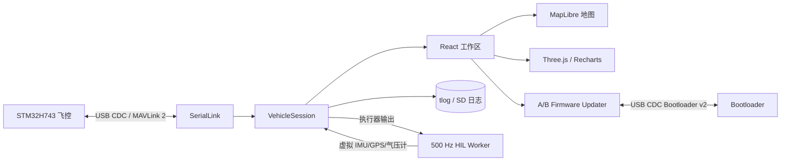
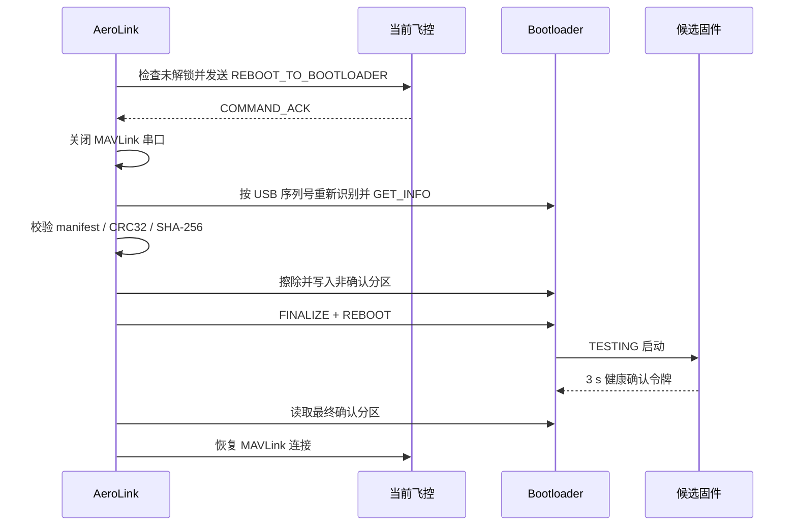

# AeroLink UAV Control Station

面向 STM32H743 四旋翼飞控的 Windows Electron 上位机，提供 USB CDC/MAVLink 2 通信、实时遥测、参数管理、SD 日志下载、原始 `.tlog` 回放、Quad-X 六自由度 HIL、3D/地图可视化以及原生 A/B 固件升级。

> **English abstract:** AeroLink is an Electron-based ground-control and HIL workstation for an STM32H743 flight controller. It combines MAVLink 2 telemetry, parameter and log services, a fixed-step 6-DOF HIL engine, replay/visualization tools, and a native USB CDC A/B firmware updater in one desktop application.

[](LICENSE)


## 项目组合

- [STM32H743 UAV Flight Controller](https://github.com/ydwawly/my_new_uav_basic_framework)：传感器、VQF/ESKF、级联控制、SD 黑匣子与 FreeRTOS 实时架构。
- [STM32H743 UAV A/B Bootloader](https://github.com/ydwawly/stm32h743-uav-ab-bootloader)：USB CDC A/B 分区升级、CRC32、试运行确认、IWDG 回滚与物理断电验证。
- **本仓库**：飞控监控、HIL、日志、参数和图形化固件升级客户端。

## 核心能力

| 模块 | 能力 |
|---|---|
| 设备连接 | Windows COM 扫描、USB CDC 序列号识别、自动重连与链路统计 |
| MAVLink 2 | 分帧/粘包解析、CRC、24-bit message ID、序号与丢包统计 |
| 遥测监控 | 姿态、位置、速度、传感器、RC、电机和系统状态统一数据模型 |
| 参数与命令 | 参数读取/缺包补传/类型保持、COMMAND_ACK 闭环与错误提示 |
| 日志 | SD 日志列表、分块下载、删除保护、标准 MAVLink `.tlog` 回放 |
| HIL | Web Worker 内 500 Hz 固定步长 6-DOF 动力学、虚拟传感器和故障注入 |
| 可视化 | Three.js 机体姿态、Recharts 曲线、MapLibre 轨迹与在线地图 |
| 固件升级 | `.uavfw` 校验、非活动分区选择、USB 重枚举、上传、确认与回滚结果展示 |

默认不生成假数据；浏览器演示必须显式使用 `?demo=1`。真实串口、文件选择、HIL 闭环和固件升级只在 Electron 桌面进程中启用。

## 软件架构



Electron 主进程拥有串口、文件系统和升级会话，React 渲染进程只通过受限 preload API 访问这些能力。HIL 和回放计算在 Worker 中运行，避免阻塞界面线程。

## 主要页面

| 页面 | 用途 |
|---|---|
| 监控 | 飞行状态、姿态、位置、链路与系统告警 |
| 曲线 | 多通道实时遥测与历史窗口 |
| 参数 | 参数列表、读取、类型保持和写入确认 |
| 日志 | 飞控 SD 日志列表、下载、删除及进度管理 |
| 设备 | 串口连接、诊断与 A/B 固件升级 |
| HIL | 闭环动力学或估计器验证、轨迹和故障配置 |
| 回放 | 标准 MAVLink big-endian tlog 与 AeroLink 历史格式回放 |

## A/B 固件升级流程



升级界面在飞控已解锁时拒绝操作；进入 Metadata 提交或试运行阶段后禁止取消。CRC32/SHA-256用于传输与文件一致性校验，不等同于数字签名。Bootloader 的四阶段物理断电与回滚证据见[配套验证报告](https://github.com/ydwawly/stm32h743-uav-ab-bootloader/blob/main/docs/POWER_LOSS_VALIDATION_2026-09-28.md)。

## 快速开始

需要 Node.js 22.12+，推荐 Windows 10/11。系统使用 `usbser.sys` 识别标准 USB CDC ACM，不需要自研内核驱动。

```powershell
git clone https://github.com/ydwawly/aerolink-uav-control-station.git
cd aerolink-uav-control-station
npm ci
npm run desktop
```

只预览界面：

```powershell
npm run dev
# 浏览器访问 http://localhost:5173/?demo=1
```

常用质量命令：

```powershell
npm test
npm run build
npm audit --omit=dev
npm run test:soak -- --seconds=10
```

生成 Windows 安装包：

```powershell
npm run desktop:installer
```

## 测试状态

| 检查 | 当前结果 |
|---|---:|
| Node 行为测试 | 32/32 通过 |
| TypeScript + Vite 生产构建 | 通过 |
| 完整 npm 依赖审计 | 0 个已知漏洞 |
| Python 生成包 → Node 解包互操作 | 通过 |
| Electron 原生 A/B 实板升级 | 通过 |
| A/B 连续往返 | 24/24 通过 |

测试覆盖 MAVLink 分帧/CRC、参数与命令、日志下载、HIL、串口背压、固件包校验、非活动分区选择、取消/错误清理和升级状态机。实板结论必须结合对应固件提交和 Bootloader 验证报告理解。

## 仓库结构

```text
electron/              主进程、串口、MAVLink、HIL/回放 Worker、升级器
src/                   React 页面、组件、数据模型与可视化
src/protocol/generated MAVLink TypeScript 生成代码
protocol_definitions/  MAVLink XML 定义
scripts/               协议生成、HIL/通信压力工具
tools/log_analysis/     可复现的 SD 黑匣子下载与分析工具
tests/                 Node 集成与行为回归测试
docs/                  飞控联调和日志分析说明
```

运行生成的日志、下载文件、安装包、`node_modules` 和构建缓存均被忽略，不提交到仓库。

## 安全与边界

- 固件升级、HIL 和电机联调必须拆除螺旋桨并断开电机动力电源。
- 地图使用 OpenStreetMap 在线瓦片；离线时保留已有轨迹数据，但不下载新瓦片。
- MapLibre GL 6.11.2 要求 WebGL 2；Worker 被 Vite 打包为独立 ES Module 资源。
- 当前升级包未实现数字签名、加密或防降级，不应用于不可信固件分发场景。
- 项目未经适航或功能安全认证，不可直接用于载人或其他高风险设备。

## License

项目自有代码使用 [MIT License](LICENSE)。Electron、React、MapLibre、Three.js、MAVLink 生成代码及其他依赖遵循各自许可证，见 [THIRD_PARTY_NOTICES.md](THIRD_PARTY_NOTICES.md)。
